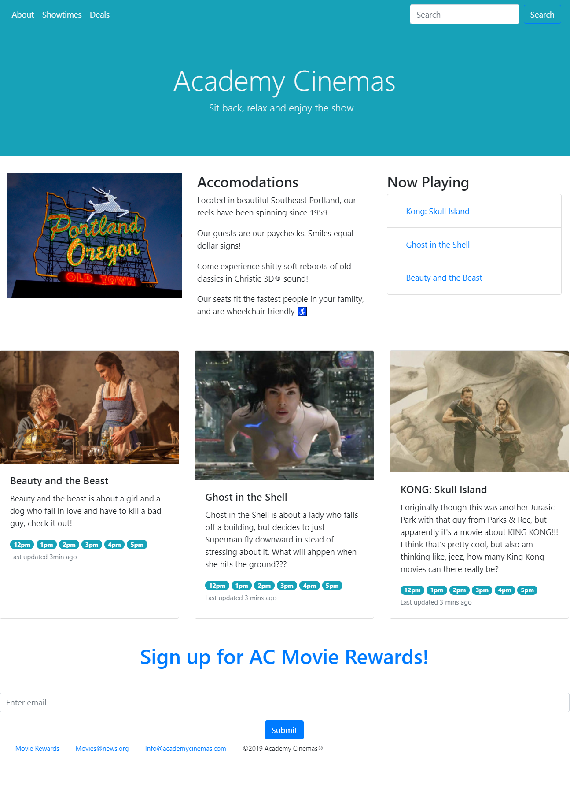

**

Current Employment
==================

Director of Technology - Hillcrest Ski & Sports
-----------------------------------------------

From 'Web Master' to head of tech...

When tasked to create a website for a 50 year old outdoor company I discovered the level of complexity required to build something functional would require intense focus. In 6 short months I wrote custom software to integrate inventory data stored in a B-Tree, flat-file database with the modern eCommerce platform BigCommerce.

My software includes a custom API that integrates with legacy shop-management software (Retail Pro) storing 25 years worth of data, custom web-scraping protocols with copyright validation to attach images to products without worry of infringment and a constant price/qty refresh of the website's database.

Having a real time copy of our inventory has allowed us to open our back office to online sales and engage in Omnichannel Fulfillment during the Coronavirus pandemic. Opening our store to these channels proved essential to the survival of the company.

I work mostly in Python, the key libraries that I use in my day-to-day include pandas, numpy, matplotlib.pyplot, requests, scrapey and xml.ElementTree

These tools have allowed me to clear years worth of backlogs in this company's accounting department, streamline the product creation process (we order a LOT of stuff around fall time), and automate almost all of the boring stuff that keeps this company's heart beating.

Have a look at what a coding boot camp and 3 years of self-study can help to accomplish for a small business at [hillcrestsports.com](https://www.hillcrestsports.com/)

Retail Pro | Big Commerce API
=============================

### Custom software that set a small ski shop free

Mirroring a legacy database on a modern platform

- Tech used: Python, scrapey, RESTful API

* * * * *

#### The website: BigCommerce

As of October 2020, there are 10,886 products on our website, and 95% of them are coupled with images and descriptions, thanks to a very complicated application of Python's scrapey library.

* * * * *

#### The source: Retail Pro

This dinosaur of a product is used by everyone in the company, from the accountant to the guy at the rental counter. With no publically available API, and read-only access to its underlyign database, getting data out of this thing took months

* * * * *

Recent Experience
=================

Prosper I.T. Internship - A Web Application for Theatre Vertigo in downtown Portland
------------------------------------------------------------------------------------

Worked in a team of software developers, participating in daily stand-ups and multiple sprint cycles. Helped develop a C\# / ASP.NET web application for a small theatre company in Portland. Using MVC and Data Access Layer methodologies, developed back end functionality to enable non-technical theatre staff to upload, manage, and showcase custom content that empowered their virtual brand. Utilized Razor, CSS and JavaScript to implement aesthetic/cosmetic changes.

Key technologies used: Visual C\#, ASP.NET, Entity Framework, MS SQL Management Studio, JavaScript

Featured Story: Capturing user-uploaded images to the database
--------------------------------------------------------------

#### Assigning myself the task on Azure DevOps

Tasked with finding a way to allow users to upload images by file that can then be stored in the database as Byte Arrays.

- Tech used: Azure DevOps, Visual Studio 2019, Microsoft Teams Server

* * * * *

#### Implementing a Helper Method and UploadImage Controller

The UploaImage view prompts the user to select a file for upload. The file is sent to the Controller as an HttpPostedFileBase object and the Helper method performs the necessary logic to convert the file into a Byte Array to be able to store the photo in the database.

- Viewbag, Razor syntax, MVC

* * * * *

#### The View: Retrieving the image bytes from the database.

In order to make sure the image was being uploaded and stored correctly, I built an additional Helper method to display the image. Converting the Byte Array representation of the image into a Base64 String, I was able to display the image inline.

- Tech used: IIS, MS Sql Management Studio

* * * * *

Older Projects
--------------

#### My first Python Script (c. 2015)

- This short program was part of my thesis in grad school, which helped me to obtain my Masters in Applied Mathematics

- Tech used: Numpy/SciPy, matplotlib, Graph theory, N-dimensional Differential Equations

[Click here to see it on GitHub](https://github.com/bagpyp/graphTheoreticDynamics)

* * * * *

#### Car Insurance Quote

- This C\# and MVC project genereates a car insurance quote based on the user's input.

- Tech used: ASP.NET, IIS

[Click here to see it on GitHub](https://github.com/bagpyp/CS_webApps_MVC/tree/master/CarInsuranceQuote/CarInsuranceQuote)

* * * * *

#### Pizza Ordering Menu

- This is a JavaScript project that calculates the final pizza price based on selections.

- Tech used: HTML, CSS, JavaScript

[Click here to see it on GitHub](https://github.com/bagpyp/pizzaMenu_JS)

* * * * *

#### Tic Tac Toe

- This is another JavaScript project, a game of Tic Tac Toe with lots of sounds and pop-ups

- Tech used: JavaScript, CSS, HTML

[Click here to see it on GitHub](https://github.com/bagpyp/JS_ticTacToe)

* * * * *

#### Academy Cinemas Website

- This is a Bootstrap project that I put together to practice using the bootstrap framework

- Tech used: HTML, CSS, Bootstrap

[Click here to see it on GitHub](https://github.com/bagpyp/academyCinemas)

* * * * *

#### Library Management System

- This is an SQL project creating a Library Management System database and schema using SQL Server.

- Tech used: SQL

[Click here to see it on GitHub](https://github.com/bagpyp/SQL_advanced)

* * * * *

Contact Me
----------

**

#### LinkedIn

* * * * *

[linkedin.com/in/robert3825](https://www.linkedin.com/in/robert3825/)

**

#### Email

* * * * *

[rtc@bagpyp.net](mailto:rtc@bagpyp.net)

**

#### GitHub

* * * * *

[bagpyp](https://github.com/bagpyp)

Robert Cunningham - Software Developer

# serve local
npm run start-js will bypass the build for local dev/hot-reload, 
but npm start fires node server.js for the deployed-to-heroku state. 

# to push
run npm run build, then commit/push to heroku master
and push to origin master or wtvr

@bagpyp
bagpyp.net
github.com/bagpyp
lnkedin.com/in/robert3925
rtc@bagpyp.net
portland, or
full stack dev
5038034458